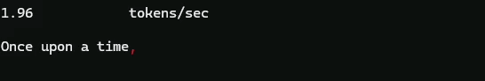
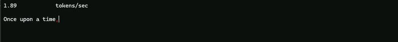
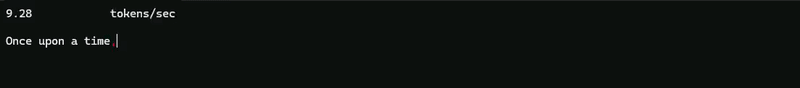

# BasicLLM

Header-only Llama 2 inference in C++, from scratch.

<!-- HERO VISUAL: docs/demo.gif  (colored per-token stream + live tokens/sec) -->
<p align="left">
  
  <br>
  <sub><i>Recorded on a Debug build. White is the prompt; each colored chunk after it is one generated token, streamed as it is sampled.</i></sub>
</p>

BasicLLM runs a real Llama 2 model on the CPU with no external dependencies. It loads weights in the [llama2.c](https://github.com/karpathy/llama2.c) binary format, tokenizes with a from-scratch BPE tokenizer, and runs the forward pass through a hand-written tensor library whose strided-view design is inspired by [ggml](https://github.com/ggerganov/ggml). It ships with a small model (`stories15M`, ~58 MB) so you can build and run it in a few seconds.

The core is header-only C++17; the only tooling is a standard-library Python script to fetch the model.

> [!NOTE]
> The code here is deliberately unoptimized: single-threaded, no SIMD, plain f32, naive matmul. Every op is written to be read and understood, not to be fast. If you want speed, use [llama.cpp](https://github.com/ggerganov/llama.cpp); if you want to know what it is doing under the hood, read on.

## Features

- ggml-style tensor: shape, strides, and zero-copy views (transpose and slice cost nothing).
- Hand-written ops: matmul, softmax, RMSNorm, SiLU, RoPE, multi-head attention, SwiGLU.
- BPE tokenizer against the Llama 2 SentencePiece vocab (32000 tokens), in llama2.c's binary format.
- Greedy and temperature sampling.
- KV cache, with a side-by-side comparison against the naive recompute path.
- Colored per-token streaming and a live tokens/sec readout.
- No dependencies beyond the C++17 standard library.

## Getting Started

Requires a C++17 compiler, CMake >= 3.20, and Python 3 (only to fetch the model).

```bash
git clone https://github.com/bertaye/BasicLLM.git
cd BasicLLM

python models/download.py                 # stories15M.bin + tokenizer.bin (~58 MB)

cmake -B build
cmake --build build --config Release
```

Run from the `build` directory so the model path (`../models`) resolves:

```bash
cd build
./basicllm                 # Linux/macOS
# .\Release\basicllm.exe   # Windows / MSVC
```

## Usage

`Model` loads the weights and tokenizer; `Generate` (naive) and `GenerateWithKVCache` both stream tokens to an output stream.

```cpp
#include "Model.h"

int main() {
    Model model("models/stories15M.bin", "models/tokenizer.bin");

    model.enableLiveMetrics();                                   // live tokens/sec readout
    model.GenerateWithKVCache("Once upon a time",
                              /*maxTokens=*/256,
                              /*temperature=*/0.0f,              // 0 = greedy
                              std::cout);
}
```

Pass a non-zero `temperature` for sampling. `Generate(...)` has the same signature and runs the naive full-recompute path (useful for the performance comparison below).

## Performance

`stories15M` on CPU, same prompt, greedy decoding. The KV cache computes each token's keys and values once instead of recomputing the whole sequence every step, turning the per-token cost from O(n) into O(1) as the sequence grows.

| Path | tokens/sec |
|------|-----------|
| `Generate` (naive recompute) | ~0.5 |
| `GenerateWithKVCache` | ~6.5 |

<table>
  <tr>
    <td align="center"><code>Generate</code> (naive recompute)</td>
    <td align="center"><code>GenerateWithKVCache</code></td>
  </tr>
  <tr>
    <td valign="top"></td>
    <td valign="top"></td>
  </tr>
</table>

Numbers scale with sequence length and machine; the two paths produce identical output at temperature 0.

## Chapters: Build It Yourself

You can implement this entire engine yourself. Each `Ch*` folder is a self-contained mini-project: a README that teaches the concepts, headers where every function has its math in a comment and an **empty body**, and a test runner that reports each op as `OK` / `FAILED` / `SKIPPED`. From Chapter 2 on, your numbers are checked against this repository's reference implementation running the real `stories15M` weights. Later chapters ship the earlier answers, so every folder builds standalone.

| Chapter | You implement |
|---------|---------------|
| [Ch1. Architecture and Tensor Ops](Ch1.%20Architecture%20and%20Tensor%20Ops/) | The strided-tensor ops: matmul, softmax, RMSNorm, SiLU, RoPE, causal masking, attention |
| [Ch2. The Forward Pass](Ch2.%20The%20Forward%20Pass/) | Slicing, embedding lookup, projections, multi-head attention, the full transformer forward pass |
| [Ch3. Sampling](Ch3.%20Sampling/) | Greedy and temperature sampling, the autoregressive generation loop (your model writes its first story) |
| [Ch4. KV Cache](Ch4.%20KV%20Cache/) | Cached attention, prefill and decode: identical output, several times faster |

Do them in order; each chapter leans on the previous one. The tokenizer and the weight-file parsing stay given throughout (they are plumbing, not transformer knowledge) and are short, commented reads in `header/` when you get curious.

## Project Structure

```
header/                  # header-only core (namespace basicllm)
  Tensor.h               #   tensor: counts, strides, views
  TensorOps.h            #   matmul, softmax, RMSNorm, RoPE, attention, sampling
  Tokenizer.h            #   BPE encode/decode
  Model.h                #   weight loading, forward pass, Generate / GenerateWithKVCache
  BinaryFileLoader.h     #   binary file reader
  Logger.h               #   logging
src/main.cpp             # entry point
models/download.py       # fetches stories15M.bin + tokenizer.bin
Ch1. Architecture and Tensor Ops/   # the course: implement the engine yourself,
Ch2. The Forward Pass/              #   one self-contained chapter at a time
Ch3. Sampling/                      #   (each has its own README, stubs, and tests)
Ch4. KV Cache/
CMakeLists.txt
```

## Acknowledgements

- [llama2.c](https://github.com/karpathy/llama2.c) by Andrej Karpathy: the `stories15M` model, the tokenizer, and the weight format.
- [ggml](https://github.com/ggerganov/ggml) / [llama.cpp](https://github.com/ggerganov/llama.cpp): the inspiration for the strided-tensor design.

## License

[MIT](LICENSE)
